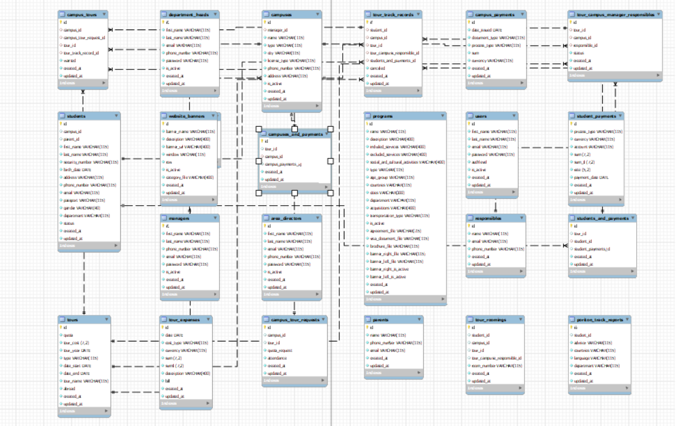

# Crud Project with GOLANG, GIN, MYSQL
This is a CRUD (Create, Read, Update, Delete) project built using Golang, Gin and MySQL. Which has JWT Authentication. The project demonstrates how to use Golang and Gin to build a RESTful API that interacts with a MySQL database. And passes json api to front end.

## Data Base Design
- 

## Requirements
To run this project, you need to have the following installed on your machine:

-Golang (1.16 or later)
-MySQL (5.7 or later)
-Gin-Gonic package (go get -u github.com/gin-gonic/gin)
-MySQL driver package (go get -u github.com/go-sql-driver/mysql)

## Requirements To Run
- github.com/dgrijalva/jwt-go
- github.com/gin-gonic/gin
- github.com/go-sql-driver/mysql
- github.com/jinzhu/gorm

### Setting up the Database
Create a new MySQL database and name it crud-api.

